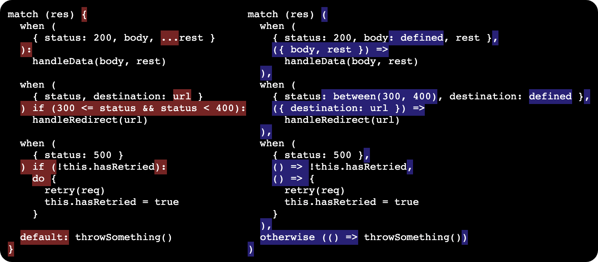

# patcom

`patcom` is pattern matching JavaScript library. Build pattern matchers from simpler smaller matchers.

> Pattern matching is a declarative programming. The code matches the shape of the data.

```sh
npm install --save patcom
```

## Simple example
Let's say we have objects that represent a `Student` or a `Teacher`.
```ts
  type Student = {
    role: 'student'
  }

  type Teacher = {
    role: 'teacher',
    surname: string
  }
```

Using `patcom` we can match a `person` by their `role` to form a `greeting`.
```js
import {match, when, otherwise, defined} from 'patcom'

...

const greeting = match (person) (
  when ({ role: 'student' }, () =>
    'Hello fellow student.'
  ),

  when ({ role: 'teacher', surname: defined }, ({ surname }) =>
    `Good morning ${surname} sensei.`
  ),

  otherwise (() =>
    'STRANGER DANGER'
  )
)
```

<details>
<summary>What is <code>match</code> doing?</summary>

[`match`](#match) finds the first [`when`](#when) clause that matches, then the [`Matched`](#core-concept) object is transformed into the `greeting`. If none of the `when` clauses match, the [`otherwise`](#otherwise) clause always matches.

If `person` is `{role: 'student'}`, then `greeting` is `'Hello fellow student'`.

If `person` is `{role: 'teacher', surname: 'Wong'}`, then `greeting` is `'Good morning Wong sensei.'`

If `person` is anything else, then `greeting` is `'STRANGER DANGER'`
</details>

## More expressive than `switch`

Pattern match over whole objects and not just single fields.

### Imperative `switch` & `if` 😔
```
switch (person.role) {
  case 'student':
    if (person.grade >= 90) {
      return 'Gold star'
    } else if (person.grade >= 60) {
      return 'Keep trying'
    } else {
      return 'See me after class'
    }
  default:
      throw new Exception(`expected student, but got ${person}`)
}
```

### Declarative `match` 🙂
```js
return match (person) (
  when ({ role: 'student', grade: greaterThanEquals(90) }, () =>
    'Gold star'
  ),

  when ({ role: 'student', grade: greaterThanEquals(60) }, () =>
    'Keep trying'
  ),

  when ({ role: 'student', grade: defined }, () =>
    'See me after class'
  ),

  otherwise ((person) =>
    throw new Exception(`expected student, but got ${person}`)
  )
)
```
<details>
<summary>What is <code>greaterThanEquals</code>?</summary>

[`greaterThanEquals`](#greaterthanequals) is a [`Matcher`](#core-concept) provided by `patcom`. `greaterThanEquals(90)` means "match a number greater or equal to 90".
</details>

## Match `Array`, `String`, `RegExp` and more
### Arrays
```js
match (list) (
  when ([], () =>
    'empty list'
  ),

  when ([defined], ([head]) =>
    `single item ${head}`
  ),

  when ([defined, rest], ([head, ...tail]) =>
    `multiple items`
  )
)
```
<details>
<summary>What is <code>rest</code>?</summary>

`rest` is a special `matcher` used within array and object patterns. Array and objects are complete matches and the `rest` pattern consumes all remaining values.
</details>

### `String` & `RegExp`
```js
match (command) (
  when ('sit', () =>
    sit()
  ),

  // matchedRegExp is the RegExp match result
  when (/^move (\d) spaces$/, (value, { matchedRegExp: [, distance] }) =>
    move(distance)
  ),

  // ...which means matchedRegExp has the named groups
  when (/^eat (?<food>\w+)$/, (value, { matchedRegExp: { groups: { food } } }) =>
    eat(food)
  )
)
```

### `Number`, `BigInt` & `Boolean`
```js
match (value) (
  when (69, () =>
    'nice'
  ),

  when (69n, () =>
    'big nice'
  ),

  when (true, () =>
    'not nice'
  )
)
```

## Match complex data structures
```js
match (complex) (
  when ({ schedule: [{ class: 'history', rest }, rest] }, () =>
    'history first thing on schedule? buy coffee'
  ),

  when ({ schedule: [{ professor: oneOf('Ko', 'Smith'), rest }, rest] }, ({ schedule: [{ professor }] }) =>
    `Professor ${professor} teaching? bring voice recorder`
  )
)
```

### Matchers are extractable
From the previous example, complex patterns can be broken down to simpler matchers.
```js
const fastSpeakers = oneOf('Ko', 'Smith')

match (complex) (
  when ({ schedule: [{ class: 'history', rest }, rest] }, () =>
    'history first thing on schedule? buy coffee'
  ),

  when ({ schedule: [{ professor: fastSpeakers, rest }, rest] }, ({ schedule: [{ professor }] }) =>
    `Professor ${professor} teaching? bring voice recorder`
  )
)
```

## Custom matchers
Define custom matchers with any logic. [`Matcher`](#core-concept)s are simply functions that take in a `value` and returns a [`Result`](#core-concept). Either the `value` is [`Matched`](#core-concept) or is [`Unmatched`](#core-concept).

```js
function matchDuck(value) {
  if (value.type === 'duck') {
    return {
      matched: true,
      value
    }
  }
  return {
    matched: false
  }
}

...

function speak(animal) {
  return match (animal) (
    when (matchDuck, () =>
      'quack'
    ),

    when (matchDragon, () =>
      'rawr'
    )
  )
)
```

All the examples thus far have been using [`match`](#match), but `match` itself isn't a matcher. In order to use `speak` in another pattern, we use [`oneOf`](#oneof) instead.

```js
const speakMatcher = oneOf (
  when (matchDuck, () =>
    'quack'
  ),

  when (matchDragon, () =>
    'rawr'
  )
)
```

Now upon unrecognized animals, whereas `speak` previously returned `undefined`, `speakMatcher` now returns `{ matched: false }`. This allows us to combine `speakMatcher` with other patterns.

```js
match (animal) (
  when (speakMatcher, (sound) =>
    `the ${animal.type} goes ${sound}`
  ),

  otherwise(() =>
    `the ${animal.type} remains silent`
  )
)
```

Everything except for `match` is actually a [`Matcher`](#core-concept), including `when` and `otherwise`. Primative value and data types are automatically converted to a corresponding matcher.

```js
when ({ role: 'student' }, ...) === when (matchObject({ role: 'student' }), ...)

when ([defined], ...) === when (matchArray([defined]), ...)

when ('sit', ...) === when (matchString('sit'), ...)

when (/^move (\d) spaces$/, ...) === when (matchRegExp(/^move (\d) spaces$/), ...)

when (69, ...) === when (matchNumber(69), ...)

when (69n, ...) === when (matchBigInt(69n), ...)

when (true, ...) === when (matchBoolean(true), ...)
```

Even the complex patterns are composed of simpler matchers.
### Primatives
```js
when (
  {
    schedule: [
      {
        class: 'history',
        rest
      },
      rest
    ]
  },
  ...
)
```
### Equivalent explict matchers
```js
when (
  matchObject({
    schedule: matchArray([
      matchObject({
        class: matchString('history'),
        rest
      }),
      rest
    ])
  }),
  ...
)
```

## Core concept
At the heart of `patcom`, everything is built around a single concept, the `Matcher`. The `Matcher` takes any `value` and returns a `Result`, which is either `Matched` or `Unmatched`.

```ts
type Matcher<T> = (value: any) => Result<T>

type Result<T> = Matched<T> | Unmatched

type Matched<T> = {
  matched: true,
  value: T
}

type Unmatched = {
  matched: false
}
```

### Built-in `Matcher`s
Directly useable Matchers.
- #### `any`
  ```ts
  const any: Matcher<any>
  ```
  Matches for any value, including `undefined`.
  <details>
  <summary>Example</summary>

  ```js
  const matcher = any

  matcher(undefined) === { matched: true, value: undefined }
  matcher({ key: 'value'}) === { matched: true, value: {key: 'value' } }
  ```
  </details>

- #### `defined`
  ```ts
  const defined: Matcher<any>
  ```
  Matches for any defined value, or in other words not `undefined`.
  <details>
  <summary>Example</summary>

  ```js
  const matcher = defined

  matcher({ key: 'value' }) === { matched: true, value: {key: 'value' } }

  matcher(undefined) === { matched: false }
  ```
  </details>

- #### `empty`
  ```ts
  const empty: Matcher<[] | {} | ''>
  ```
  Matches either `[]`, `{}`, or `''` (empty string).
  <details>
  <summary>Example</summary>

  ```js
  const matcher = empty

  matcher([]) ≡ { matched: true, value: [] }
  matcher({}) ≡ { matched: true, value: {} }
  matcher('') ≡ { matched: true, value: '' }

  matcher(undefined) ≡ { matched: false }
  matcher({ key: 'value' }) ≡ { matched: false }
  ```
  </details>

### `Matcher` builders
Builders to create a `Matcher`.
- #### `between`
  ```ts
  function between(lower: number, upper: number): Matcher<number>
  ```
  Matches if value is a `Number`, where `lower <= value < upper`
  <details>
  <summary>Example</summary>

  ```js
  const matcher = between(10, 20)

  matcher(9) ≡ { matched: false }
  matcher(10) ≡ { matched: true, value: 10 }
  matcher(19) ≡ { matched: true, value: 19 }
  matcher(20) ≡ { matched: false }

  matcher(undefined) ≡ { matched: false }
  matcher({ key: 'value' }) ≡ { matched: false }
  ```
  </details>

- #### `equals`
  ```ts
  function equals<T>(expected: T): Matcher<T>
  ```
  Matches `expected` if strictly equals `===` to value.
  <details>
  <summary>Example</summary>

  ```js
  const matcher = equals('alice')

  matcher('alice') ≡ { matched: true, value: 'alice' }
  matcher(42) ≡ { matched: false }

  matcher(undefined) ≡ { matched: false }
  matcher({ key: 'value' }) ≡ { matched: false }
  ```
  ```js
  const matcher = equals(42)

  matcher('alice') ≡ { matched: false }
  matcher(42) ≡ { matched: true, value: 42 }

  matcher(undefined) ≡ { matched: false }
  matcher({ key: 'value' }) ≡ { matched: false }
  ```
  </details>

- #### `greaterThan`
  ```ts
  function greaterThan(expected: number): Matcher<number>
  ```
  Matches if value is a `Number`, where `expected < value`
  <details>
  <summary>Example</summary>

  ```js
  const matcher = greaterThan(10)

  matcher(9) ≡ { matched: false }
  matcher(10) ≡ { matched: false }
  matcher(11) ≡ { matched: true, value: 11 }

  matcher(undefined) ≡ { matched: false }
  matcher({ key: 'value' }) ≡ { matched: false }
  ```
  </details>

- #### `greaterThanEquals`
  ```ts
  function greaterThanEquals(expected: number): Matcher<number>
  ```
  Matches if value is a `Number`, where `expected <= value`
  <details>
  <summary>Example</summary>

  ```js
  const matcher = greaterThanEquals(10)

  matcher(9) ≡ { matched: false }
  matcher(10) ≡ { matched: true, value: 10 }
  matcher(11) ≡ { matched: true, value: 11 }

  matcher(undefined) ≡ { matched: false }
  matcher({ key: 'value' }) ≡ { matched: false }
  ```
  </details>

- #### `lessThan`
  ```ts
  function lessThan(expected: number): Matcher<number>
  ```
  Matches if value is a `Number`, where `expected > value`
  <details>
  <summary>Example</summary>

  ```js
  const matcher = lessThan(10)

  matcher(9) ≡ { matched: true, value: 9 }
  matcher(10) ≡ { matched: false }
  matcher(11) ≡ { matched: false }

  matcher(undefined) ≡ { matched: false }
  matcher({ key: 'value' }) ≡ { matched: false }
  ```
  </details>

- #### `lessThanEquals`
  ```ts
  function lessThanEquals(expected: number): Matcher<number>
  ```
  Matches if value is a `Number`, where `expected >= value`
  <details>
  <summary>Example</summary>

  ```js
  const matcher = lessThanEquals(10)

  matcher(9) ≡ { matched: true, value: 9 }
  matcher(10) ≡ { matched: true, value: 10 }
  matcher(11) ≡ { matched: false }

  matcher(undefined) ≡ { matched: false }
  matcher({ key: 'value' }) ≡ { matched: false }
  ```
  </details>

- #### `matchNonEmptyString`
  ```ts
  const nonEmptyString: Matcher<string>
  ```
  Matches if value is a `String` that is not empty, or in other words `value !== ''`.
  <details>
  <summary>Example</summary>

  ```js
  const matcher = nonEmptyString

  matcher('alice') ≡ { matched: true, value: 'alice' }

  matcher('') ≡ { matched: false }
  matcher(undefined) ≡ { matched: false }
  matcher({ key: 'value' }) ≡ { matched: false }
  ```
  </details>

- #### `matchPredicate`
  ```ts
  function matchPredicate<T>(predicate: () => Boolean): Matcher<T>
  ```
  Matches value that satisfies the predicate, or in other words `predicate(value) === true`
  <details>
  <summary>Example</summary>

  ```js
  const isEven = (x) => x % 2 === 0
  const matcher = matchPredicate(isEven)

  matcher(2) ≡ { matched: true, value: 2 }

  matcher(1) ≡ { matched: false }
  matcher(undefined) ≡ { matched: false }
  matcher({ key: 'value' }) ≡ { matched: false }
  ```
  </details>

- #### `matchBigInt`
  ```ts
  function matchBigInt(expected?: bigint): Matcher<bigint>
  ```
  Matches if value is the `expected` BigInt. Matches any defined BigInt if `expected` is not provided.
  <details>
  <summary>Example</summary>

  ```js
  const matcher = matchBigInt(42n)

  matcher(42n) ≡ { matched: true, value: 42n }

  matcher(69n) ≡ { matched: false }
  matcher(42) ≡ { matched: false }
  matcher(undefined) ≡ { matched: false }
  matcher({ key: 'value' }) ≡ { matched: false }
  ```
  ```js
  const matcher = matchBigInt()

  matcher(42n) ≡ { matched: true, value: 42n }
  matcher(69n) ≡ { matched: true, value: 69n }

  matcher(42) ≡ { matched: false }
  matcher(undefined) ≡ { matched: false }
  matcher({ key: 'value' }) ≡ { matched: false }
  ```
  </details>

- #### `matchNumber`
  ```ts
  function matchNumber(expected?: number): Matcher<number>
  ```
  Matches if value is the `expected` `Number`. Matches any defined `Number` if `expected` is not provided.
  <details>
  <summary>Example</summary>

  ```js
  const matcher = matchNumber(42)

  matcher(42) ≡ { matched: true, value: 42 }

  matcher(69) ≡ { matched: false }
  matcher(42n) ≡ { matched: false }
  matcher(undefined) ≡ { matched: false }
  matcher({ key: 'value' }) ≡ { matched: false }
  ```
  ```js
  const matcher = matchNumber()

  matcher(42) ≡ { matched: true, value: 42 }
  matcher(69) ≡ { matched: true, value: 69 }

  matcher(42n) ≡ { matched: false }
  matcher(undefined) ≡ { matched: false }
  matcher({ key: 'value' }) ≡ { matched: false }
  ```
  </details>

- #### `matchProp`
  ```ts
  function matchProp(expected: string): Matcher<string>
  ```
  Matches if value has `expected` as a property key, or in other words `expected in value`.
  <details>
  <summary>Example</summary>

  ```js
  const matcher = matchProp('x')

  matcher({ x: 42 }) ≡ { matched: true, value: { x: 42 } }

  matcher({ y: 42 }) ≡ { matched: false }
  matcher({}) ≡ { matched: false }
  matcher(undefined) ≡ { matched: false }
  ```
  </details>

- #### `matchString`
  ```ts
  function matchString(expected?: string): Matcher<string>
  ```
  Matches if value is the `expected` `String`. Matches any defined `String` if `expected` is not provided.
  <details>
  <summary>Example</summary>

  ```js
  const matcher = matchString('alice')

  matcher('alice') ≡ { matched: true, value: 'alice' }

  matcher('bob') ≡ { matched: false }
  matcher(undefined) ≡ { matched: false }
  matcher({ key: 'value' }) ≡ { matched: false }
  ```
  ```js
  const matcher = matchString()

  matcher('alice') ≡ { matched: true, value: 'alice' }
  matcher('bob') ≡ { matched: true, value: 'bob' }

  matcher(undefined) ≡ { matched: false }
  matcher({ key: 'value' }) ≡ { matched: false }
  ```
  </details>

- #### `matchRegExp`
  ```ts
  function matchRegExp(expected: RegExp): Matcher<string>
  ```
  Matches if value matches the `expected` `RegExp`. `Matched` will include the `RegExp` match object as the `matchedRegExp` property.
  <details>
  <summary>Example</summary>

  ```js
  const matcher = matchRegExp(/^dear (\w+)$/)

  matcher('dear alice') ≡ { matched: true, value: 'dear alice', matchedRegExp: ['dear alice', 'alice'] }

  matcher('hello alice') ≡ { matched: false }
  matcher(undefined) ≡ { matched: false }
  matcher({ key: 'value' }) ≡ { matched: false }
  ```
  ```js
  const matcher = matchRegExp(/^dear (?<name>\w+)$/)

  matcher('dear alice') ≡ { matched: true, value: 'dear alice', matchedRegExp: { groups: { name: 'alice' } } }

  matcher('hello alice') ≡ { matched: false }
  matcher(undefined) ≡ { matched: false }
  matcher({ key: 'value' }) ≡ { matched: false }
  ```
  </details>


### `Matcher` composers
Creates a `Matcher` from other `Matcher`s.
- #### `matchArray`
  ```ts
  function matchArray<T>(expected?: T[]): Matcher<Array<T>>
  ```
  Matches `expected` array of matchers completely. Values must be an array with the same number of elements as `expected` array. Each element in value array must match to the coresponding matcher in expected array. Primatives in `expected` are wrapped with their corresponding `Matcher` builder. Value is allowed to have more elements than `expected` array if special `rest` matcher is used to consume remainder of elements. Rest of properties grouped into the `rest` property on the matched result. Matches any defined array if `expected` is not provided.
  <details>
  <summary>Example</summary>

  ```js
  const matcher = matchArray([42, 'alice'])

  matcher([42, 'alice']) ≡ { matched: true, value: [42, 'alice'] }

  matcher([42, 'alice', true, 69]) ≡ { matched: false }
  matcher([]) ≡ { matched: false }
  matcher([42]) ≡ { matched: false }
  matcher(['alice']) ≡ { matched: false }
  matcher([69, 'alice']) ≡ { matched: false }
  matcher(undefined) ≡ { matched: false }
  matcher({ key: 'value' }) ≡ { matched: false }
  ```
  ```js
  const matcher = matchArray([42, 'alice', rest])

  matcher([42, 'alice']) ≡ { matched: true, value: [42, 'alice'] }
  matcher([42, 'alice', true, 69]) ≡ { matched: true, value: [42, 'alice', true, 69], rest: [true, 69]] }

  matcher([]) ≡ { matched: false }
  matcher([42]) ≡ { matched: false }
  matcher(['alice']) ≡ { matched: false }
  matcher([69, 'alice']) ≡ { matched: false }
  matcher(undefined) ≡ { matched: false }
  matcher({ key: 'value' }) ≡ { matched: false }
  ```
  ```js
  const matcher = matchArray()

  matcher([42, 'alice']) ≡ { matched: true, value: [42, 'alice'] }
  matcher([42, 'alice', true, 69]) ≡ { matched: true, value: [42, 'alice', true, 69] }
  matcher([]) ≡ { matched: true, value: [] }
  matcher([42]) ≡ { matched: true, value: [42] }
  matcher(['alice']) ≡ { matched: true, value: ['alice'] }
  matcher([69, 'alice']) ≡ { matched: true, value: [69, 'alice'] }

  matcher(undefined) ≡ { matched: false }
  matcher({ key: 'value' }) ≡ { matched: false }
  ```
  </details>

- #### `matchObject`
  ```ts
  function matchObject<T>(expected?: T): Matcher<T>
  ```
  Matches `expected` object of matchers completely. Values must be an object with the same set of keys as `expected` object. Each value in object must match to the coresponding matcher in expected object. Primatives in `expected` are wrapped with their corresponding `Matcher` builder. Value is allowed to have more keys than `expected` object if special `rest` matcher is used to consume reaminder of keys. Rest of properties grouped into the `rest` property on the matched result. Matches any defined object if `expected` is not provided.
  <details>
  <summary>Example</summary>

  ```js
  const matcher = matchObject({ x: 42, y: 'alice' })

  matcher({ x: 42, y: 'alice' }) ≡ { matched: true, value: { x: 42, y: 'alice' } }

  matcher({ x: 42, y: 'alice', z: true, aa: 69 }) ≡ { matched: false }
  matcher({}) ≡ { matched: false }
  matcher({ x: 42 }) ≡ { matched: false }
  matcher({ y: 'alice' }) ≡ { matched: false }
  matcher(undefined) ≡ { matched: false }
  ```
  ```js
  const matcher = matchObject({ x: 42, y: 'alice', rest })

  matcher({ x: 42, y: 'alice' }) ≡ { matched: true, value: { x: 42, y: 'alice' } }
  matcher({ x: 42, y: 'alice', z: true, aa: 69 }) ≡ { matched: true, value: { x: 42, y: 'alice', z: true, aa: 69 }, rest: { z: true, aa: 69 } }

  matcher({}) ≡ { matched: false }
  matcher({ x: 42 }) ≡ { matched: false }
  matcher({ y: 'alice' }) ≡ { matched: false }
  matcher(undefined) ≡ { matched: false }
  ```
  ```js
  const matcher = matchObject()

  matcher({ x: 42, y: 'alice' }) ≡ { matched: true, value: { x: 42, y: 'alice' } }
  matcher({ x: 42, y: 'alice', z: true, aa: 69 }) ≡ { matched: true, value: { x: 42, y: 'alice', z: true, aa: 69 } }
  matcher({}) ≡ { matched: true, value: {} }
  matcher({ x: 42 }) ≡ { matched: true, value: { x: 42 } }
  matcher({ y: 'alice' }) ≡ { matched: true, value: { y: 'alice' } }

  matcher({ key: 'value' }) ≡ { matched: false }
  ```
  </details>

- #### `rest`
  ```ts
  const res: Matcher<any>
  ```
  A special `Matcher` that is only valid as element of `matchArray` or property of `matchObject`. This consumes the remaining elements/properties to allow a complete match of the array/object.

- #### `allOf`
  ```ts
  function allOf<T>(expected: ...T): Matcher<T[]>
  ```
  Matches if all `expected` matchers are matched. Primatives in `expected` are wrapped with their corresponding `Matcher` builder.

- #### `oneOf`
  ```ts
  function oneOf<T>(expected: ...T): Matcher<T>
  ```
  Matches first `expected` matcher that matches. Primatives in `expected` are wrapped with their corresponding `Matcher` builder. Similar to `match`

- #### `when`
  ```ts
  function when<T, R>(expected: T, ...guards: (value: T) => Boolean, valueMapper?: (value: T) => R): Matcher<R>
  ```
  Matches if `expected` matches and satifies all the `guards`, then matched value is transformed with `valueMapper`. `guards` and `valueMapper` are optional. Primative `expected` are wrapped with their corresponding `Matcher` builder.

- #### `otherwise`
  ```ts
  function otherwise<T, R>(...guards: (value: T) => Boolean, valueMapper?: (value: T) => R): Matcher<R>
  ```
  Matches if satifies all the `guards`, then value is transformed with `valueMapper`. `guards` and `valueMapper` are optional. Primative `expected` are wrapped with their corresponding `Matcher` builder.

### `Matcher` consumers
- #### `match`
  ```ts
  function match<T>(...clauses: Matcher<T>): T | undefined
  ```
  Returns a matched value for the first clause that matches, or `undefined` if all are unmatched. Similar to `oneOf`.

## What about [TC39 pattern matching proposal](https://github.com/tc39/proposal-pattern-matching)?

`patcom` is does not implement the semantics of TC39 pattern matching proposal. However, `patcom` was inspired from TC39 pattern matching proposal and in-fact has feature parity. As `patcom` is a JavaScript library, it cannot introduce any new syntax, but the syntax remains relatively similar.

### Comparision of TC39 pattern matching proposal on left to `patcom` on right


### Differences
The most notable different is `patcom` implemented [enumerable object properties](https://developer.mozilla.org/en-US/docs/Web/JavaScript/Enumerability_and_ownership_of_properties) matching, where as TC39 pattern matching proposal implements partial object matching. See https://github.com/tc39/proposal-pattern-matching/issues/243.

Since `patcom` had to separate the pattern matching from destructuring, enumerable object properties matching is the most sensible. Syntactically separation of the pattern from destructuring is the biggest difference.

#### TC39 pattern matching proposal syntax shape
```js
when (pattern + destructuring assignment) if guard:
  expression using assignments
```
#### `patcom` syntax shape
```js
when (pattern, ...guards, (destructuring assignment) =>
  expression using assignments
)
```

`patcom` offers `allOf` and `oneOf` matchers as subsitute for the [pattern combinators](https://github.com/tc39/proposal-pattern-matching#pattern-combinators) syntax.

Additional consequence of the separating the pattern from destructuring is `patcom` has no need for any of:
- [interpolation pattern](https://github.com/tc39/proposal-pattern-matching#interpolation-pattern) syntax
- [custom matcher protocol interpolations](https://github.com/tc39/proposal-pattern-matching#custom-matcher-protocol-interpolations) syntax
- [`with` chaining](https://github.com/tc39/proposal-pattern-matching#with-chaining) syntax.

Another difference is TC39 pattern matching proposal caches iterators and object property accesses. This has been implemented in `patcom` as a different variation of `match`, which is powered by `cachingOneOf`.

To see a full comparsion with TC39 pattern matching proposal and unit tests to prove full feature parity, see [tc39-proposal-pattern-matching folder](./tc39-proposal-pattern-matching).

## What about [`match-iz`](https://github.com/shuckster/match-iz)?
`match-iz` is similarly insprired by TC39 pattern matching proposal has has many similaries to `patcom`. However, `match-iz` is not feature complete to TC39 pattern matching proposal, most notably missing is:
- when guards
- caching iterators and object property accesses

`match-iz` also offers a different match result API, where `matched` and and `value` are allowed to be functions. The same functionality in `patcom` can be found in the form of [functional mappers](./mappers.js).

## Contributions welcome
The following is a non-exhaustive list of features which could be implemented in the feature
- more unit testing
- richer set of matchers
  - as this library exports modules, the size of the npm package does not matter if consumed by a tree shaking bundler. this means matchers of any size will be accepted as long as all matchers can be organized well as a cohesive set
  - [Date](https://developer.mozilla.org/en-US/docs/Web/JavaScript/Reference/Global_Objects/Date) matcher
  - [Temporal](https://github.com/tc39/proposal-temporal) matchers
  - [Typed array](https://developer.mozilla.org/en-US/docs/Web/JavaScript/Reference/Global_Objects#indexed_collections) matchers
  - [Map](https://developer.mozilla.org/en-US/docs/Web/JavaScript/Reference/Global_Objects/Map) matcher
  - [Set](https://developer.mozilla.org/en-US/docs/Web/JavaScript/Reference/Global_Objects/Set) matcher
  - [Intl](https://developer.mozilla.org/en-US/docs/Web/JavaScript/Reference/Global_Objects/Intl) matchers
  - [Dom](https://developer.mozilla.org/en-US/docs/Web/API/Document_Object_Model) matchers
  - other [Web API](https://developer.mozilla.org/en-US/docs/Web/API) matchers
- eslint
- typescript, either by rewrite or `.d.ts` files
- async matchers
